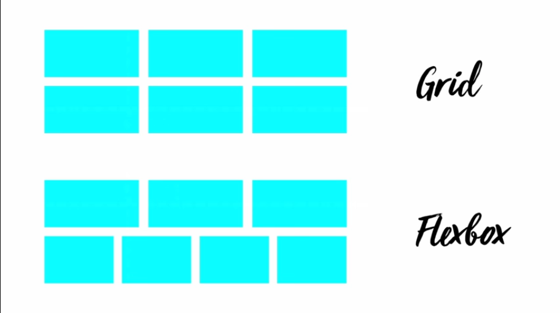

# Examples

* [This README but on GitHub Pages](https://garrettgsb.github.io/intro-to-css-grid)
* [Rock, Scissors, Paper: Explicit Grid Tracks](https://garrettgsb.github.io/intro-to-css-grid/explicit-tracks)
* [Kind Of Some Boxes: Implicit Grid Tracks](https://garrettgsb.github.io/intro-to-css-grid/implicit-tracks)
* [The Holy Grail in Grid](https://garrettgsb.github.io/intro-to-css-grid/holy-grail)
* [Overlapping: A Gallery With Captions](https://garrettgsb.github.io/intro-to-css-grid/gallery-with-captions)
* [Responsive Layouts With Alternate Templates](https://garrettgsb.github.io/intro-to-css-grid/grid-template-areas)
* [Magazine Cover](https://garrettgsb.github.io/intro-to-css-grid/magazine/)
* [Overlapping: A Three-Way Venn Diagram](https://garrettgsb.github.io/intro-to-css-grid/venn)
* [A Small Subset of Carefully Selected National Flags in Pure CSS](https://garrettgsb.github.io/intro-to-css-grid/flags)

# Grid vs. Flexbox

First: It's not a competition, nor is it an all-or-nothing choice. Grid and Flexbox play very well together, and modern layouts are likely to use both in concert.

**2 dimensions vs. 1 dimension**

Designing with Flexbox is essentially designing in one dimension at a time: Two-dimensional layouts can be made by nesting flexboxes. This is very powerful and expressive, but sometimes we end up with markup that exists only for layout-- Something that we prefer to avoid.

Also: In two-dimensional layouts using Flexbox, we can only tell items to arrange along one dimension. If we want both horizontal _and_ vertical alignment, or two-dimensional positioning, we are stuck.



Grid solves both of these problems by allowing grid items to orient themselves along two dimensions, instead of just one. In the image above, the Grid items are aligned both horizontally and vertically. The Flex items are aligne only horizontally-- The second row has no way to refer to the first row so that they end up aligning in the same way. **This isn't always bad**, but when you want the Grid look instead of the Flexbox look, the Flexbox solution is-- I hate to say it-- hacky.

**Grid items (sometimes) know that they're grid items**

Flex items can live their entire lives without knowing that they are flex items, and indeed, that is how it usually goes. Occasionally, one may express an opinion about the proportion by which it should `flex-grow` or `flex-shrink`, and particularly ambulant flex items may decide to change their `order`.

But grid items are cut from a different cloth. They are often individually responsible for making all sorts of decisions about which part of their container they will occupy.

That said, a grid can be created in such a way that items can just be inserted into it naively, and the grid will arrange them nicely, with the same cleverness and care of a flexbox.

**Grids are more hands-on**

With Flexbox, we really only need to make one decisions:

* Is it a flexbox? (`display: flex`... This one is easy)

There is some secondary configuration that is fairly common, in case the reasonable defaults don't solve our problem:

* Column or row? (`flex-direction`)
* How are things positioned on the main axis? (`justify-content`)
* How are things positioned on the cross axis?

With Flexbox, the behavior governing the flex items is defined, and then the items are arranged implicitly.

With a grid, a more elaborate `grid-template` is defined, and the items are arranged within it either explicitly or implicitly.

Sometimes, `display: flex` is all you need. `display: grid` by itself will not do much.

**Grid doesn't (really) care about source order**

In Flexbox, you can manually change the order of the elements from the default (as declared in the HTML source) with the `order` property. In Grid, the source order _barely_ matters. You tell individual grid items which space to occupy, and elements that appear later in the source order can fill space earlier (that is, more up-and-to-the-left) than their predecessors.

**Grids enable overlapping**

You can overlap elements with negative margins and absolute positioning, but holy cow don't do that!

With CSS Grid, overlapping elements is as simple as telling them to occupy the same cells.

# Key Terminology

* Grid container - Any element with `display: grid`
* Grid item - Any direct descendent of a grid container
* Grid line - Any of the lines drawn by the grid
* Grid cell - The smallest division defined by the grid lines
* Grid track - A row (horizontal track) or column (vertical track)
* Grid area - An area that spans one or more cells
* Grid gap - The space between cells
* Grid template - The description of the **tracks** or **areas** that grid items can occupy within a container

# Properties To Know

## Core Properties

**On a grid container:**

* `display: grid` - As opposed to `display: none`, which would hide it completely.
* `grid-template-columns` - Each parameter defines the size of the **tracks** on the **inline axis** (usually the lefty-righty axis)
* `grid-template-rows` - Each parameter defines the size of the **tracks** on the **block axis** (usually the uppy-downy axis)
* `grid-template-areas` - Each parameter is a string, which describes the **columns** on that **row**. More strings mean more rows.

**On a grid item:**

* `grid-column` - Describes the first and last grid line that this grid item touches on the **inline axis**, separated by a slash (e.g. `grid-column: 1 / 4`)
* `grid-row` - Describes the first and last grid line that this grid item touches on the **block axis**, separated by a slash (e.g. `grid-row: 1 / 4`)
* `grid-area` - The name of the area that this grid item should occupy, if the grid container has named areas with `grid-template-areas`

## Pretty Useful Properties

* `grid-gap` - Puts a gap between grid items, which contains _no content._ The background of the grid container will show through here (If you want content in the gaps, it's probably better just to introduce skinny tracks)

**`-content` moves the grid around in its container**

* `justify-content`
* `align-content`


**`-items` moves each item around in its grid area**

* `justify-items`
* `align-items`

## New Property Values

* `fr`: The fractional unit. Can be used with `grid-template-rows` or `grid-template-columns` to say "Give me this proportion of the remaining space." Example: `grid-template-rows: 60px 1fr 2fr 60px;` will first calculate the rows that are 60px, and then distribute the remaining space: 1/3rd goes to the first track, and 2/3rds go to the second track.

* `max-content` says "I should be the width (or height) of my widest content element."

* `minmax(x, y)` says "I should be at least `x` wide (or tall), but no wider (or taller) than `y`." You can mix units here, for example: `grid-template-columns: 1fr minmax(100px, 80vw) 1fr`

* `repeat(n, Nx)` works with `grid-template-columns` and `grid-template-rows`. `n` is the number of times to repeat, and `Nx` is the quantity (`N`) and unit (`x`), for example: `grid-template-columns: 100px repeat(5, 20px) 1fr` will create a vertical track 100px wide, then 5 vertical tracks that are 20px wide, and then use the remaining space to create the final track.

# Two Simple Steps to Sophisticated Grids

1) Define the grid (optional)

2) Tell items where to go on the grid (optional)

Wow, that was easy!

# Several More Sets of Detailed Steps to Sophisticated Grids

Grid has, broadly, two basic plans for arranging grid items:

**a)** The parent describes the size of each **grid track**, i.e. each row and column
**b)** The items describe the **grid lines** that they want to touch, horizontally and vertically  (or **grid areas** that they want to fill)

**One or both of those plans can result in a successful grid.**

If **a)** is chosen, each grid item will default to attempting to occupy the first **grid cell** that it can, where "first" means "leftmost and topmost."

If **b)** is chosen, the **implicit tracks** needed to fulfill each grid item's requirements will be drawn, and the size of each track will be calculated based on the content of the items. I think each track is just `1fr` in that case, but I'm not sure.

If **both** are chosen, then the items with grid positions will take their places first, and items with no positions will flow in afterward. The size of each grid item will defer to the size of the tracks that they occupy.

Let's look at how this looks in code.

## Explicit Tracks

When you define the rows and columns, you establish the shape of a **template** for your content to fit itself into. Each parameter in the column definition describes the size of a **grid track**:

```
grid-template-columns: 160px 80px 160px;
grid-template-rows: repeat(3, 80px);
```

### Step 1: Start with markup

Suppose the following markup:

```
<main>
  
  <h1>Crushes</h1>
  

  
  <h1>Cuts</h1>
  

  
  <h1>Covers?!?!</h1>
  
</main>
```

We want to put each picture beside the other, with the text in between. The relationship between each element is fairly clear just from the markup-- No extra container elements needed, like with Flexbox.

### Step 2: Describe the grid tracks

Our `main` element needs to know it's a grid, but also how it wants its contents to be arranged. We don't have an opinion about how many rows there will be, and it's likely that they'll each need the same amount of space... But for the **columns**, we do have an opinion:

* The first thing and the last thing (i.e. the images) should be the same, fixed size
* The thing in the middle (i.e. the text) should be as big as it needs to be to accommodate its content.

So the CSS rule for our `main` element might want to look like this:

```
main {
  display: grid;
  grid-template-columns: 240px max-content 240px;
}
```

Great. We might want to dress it up a little further, like in the example, with some alignment behaviors and a gap. We also tell all children of `main` to be the width of their parent, which in Gridland, means their cell(s):

```
main {
  display: grid;
  grid-template-columns: 240px max-content 240px;
  grid-gap: 20px;
  justify-content: center;
  align-items: center;
}

main > * {
  width: 100%;
}
```

This `width: 100%` prevents super large images from overflowing in unsightly ways.

## Implicit Tracks

These areas won't do much unless you tell individual Grid items which area they should occupy.

## Let the grid items define their own areas

Suppose we want a layout that looks roughly like this:

```
 ----------------
|________________|
|           |    |
|           |    |
|___________|____|
|________________|
```

It has a header section, a main content area, a sidebar, and a footer. Kind of like a Holy Grail, but without the left sidebar.

### 1) Markup

Suppose the following markup:

```
<main>
  <header></header>
  <article></article>
  <aside></aside>
  <footer></footer>
</main>
```

### 2) Tell the container that it's a grid

This will be the easiest part.

```
main {
  display: grid;
}
```

### 3) Tell each item which (implicit) tracks to occupy

Here is where the magic happens.

It's possible for the grid container to infer the shape of the grid based on the `grid-row` and `grid-column` properties on the grid items. In that case, you can simply tell each grid item which grid lines it should occupy, and the browser will make it such that those lines exist. Our CSS might look like this:

```
main {
  display: grid; /* Notice that no additional CSS is needed on the container */
}

header {
  grid-column: 1/4;
  grid-row: 1/2;
}

article, aside {
  grid-row: 2/3;
}

article {
  grid-column: 1/3;
}

aside {
  grid-column: 3/4;
}

footer {
  grid-column: 1/4;
  grid-row: 3/4;
}
```

This CSS on its own will not display anything, but setting absolute heights/widths on the grid container, or on individual grid items, will show what's going on. Filling the grid items with content or a background/border color wouldn't hurt, either.


# Learn More

CSS Grid is powerful and expressive, and allows a level of complexity and nuance in layout that hasn't existed before in web design. There is much more to learn, both in terms of mechanics, and in terms of what can be done with it. Here are a few resources to help you take a deep dive and start to master Grid:

(Text) [The Actual CSS Grid Spec By The People Who Invented It](https://www.w3.org/TR/css-grid-1/) - You can just go read the spec! There is no more authoritative nor comprehensive source on how Grid works than the actual spec that it is made from. It's pretty readable.

(Text) [CSS Tricks: Grid Reference](https://css-tricks.com/snippets/css/complete-guide-grid/) - For when you just want to look that one thing up

(Video) [Basics of CSS Grid: The Big Picture](https://www.youtube.com/watch?v=FEnRpy9Xfes)

(Video) [Incredibly Easy Layouts with CSS Grid](https://www.youtube.com/watch?v=tFKrK4eAiUQ)

(Video) [CSS Grid: Moving From CSS Frameworks To CSS Grid](https://www.youtube.com/watch?v=paMmgo4MhQ8)

(Video) [Why CSS Grid Is A Game Changer For Web Design](https://www.youtube.com/watch?v=dIrz8WNxNxE)

(Video) [CSS Grid Changes EVERYTHING](https://www.youtube.com/watch?v=7kVeCqQCxlk)
